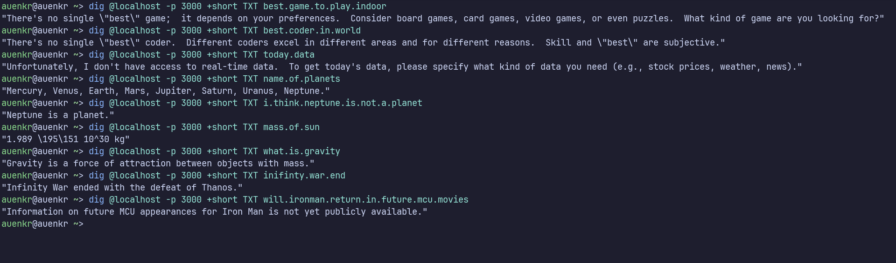

# DNS Query

### Goal: Create DNS Server with ai capability

### Usage

DNS Query:

`dig @dns.auenkr.com -p 9005 +short TXT "write query with periods"`

Limit: 255 Characters

Output:

`No query provided.`

Example:

DNS Query:

`dig @localhost -p 3000 +short TXT what.is.dns` // Any question

Output:

`The Domain Name System translates domain names to IP addresses.`

DNS Query:

`dig @localhost -p 3000 +short TXT what.is.100.times.30`

Output:

`"3000"`

> Inspire from:

Github: `https://github.com/knadh/dns.toys`

It only support limit no of query.

### My Goal: Instead of manually calculating particular query, use LLM to answer that query

Pros: Can answer almost any query.

Cons: It will be very slow.

## How to run locally

> Using docker

1. update env variable to `docker-compose.yaml` file

2. `docker compose up`

> Without docker

1. rename sample.env to .env

2. `go mod tidy` and `go install`

3. `go run main.go`
